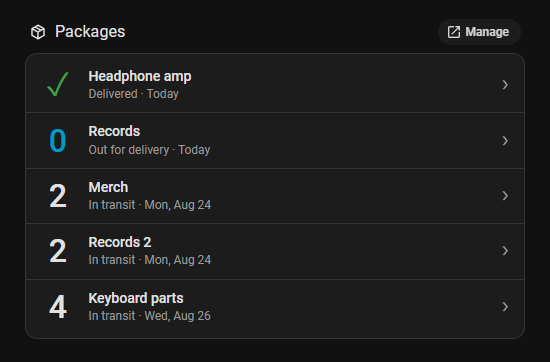

# Parcel Countdown Card

A Home Assistant Lovelace card that lists incoming packages as a countdown:
days remaining on the left, package name on the right.



Reads the `deliveries` attribute published by the
[`parcel-ha`](https://github.com/jmdevita/parcel-ha) integration, which wraps
the [Parcel](https://parcelapp.net) API. Rows read as one timeline — furthest
in the past at the top, running forward into the future, undated last — so
recently delivered packages lead. Clicking a row opens the carrier's tracking
page.

| Glyph | Meaning |
|---|---|
| `4` | days until the estimated delivery |
| `0` | arriving today |
| `!` | past its estimate |
| `–` | no date from the carrier |
| `✓` | delivered, shown in green — see `hide_delivered_after` |

Counts are calendar days measured at local midnight, and roll over without
waiting for a state update. Only `0` is highlighted; everything further out
stays in the normal text colour.

A delivered package reports when it arrived — "Delivered · Today", "Delivered ·
Yesterday", then a date — taken from its last tracking event, or its expected
date if the carrier logged no events.

## Requirements

- A [Parcel](https://parcelapp.net) account with **Parcel Premium**. The API
  this card's data comes from is a premium feature — without a subscription
  there is no API key and no data.
- The [`parcel-ha`](https://github.com/jmdevita/parcel-ha) integration,
  configured with that API key
- [HACS](https://hacs.xyz)
- Home Assistant 2024.4 or newer

## Installation

**1. Enable the raw shipment sensor.** `parcel-ha` ships it disabled, and it is
the only entity that carries the package list. Settings → Devices & services →
**Parcel App** → entities → show disabled entities → enable **Parcel Raw
Shipment Data**, then reload the integration when prompted.

**2. Install the card.** HACS → ⋮ → **Custom repositories** → add
`https://github.com/phlntn/parcel-countdown-hacs` with type **Dashboard**,
install, then hard-reload the browser.

HACS registers the dashboard resource itself. To add it by hand — or after
copying `dist/parcel-countdown-hacs.js` into `config/www/` for a manual
install — use Settings → Dashboards → ⋮ → Resources:

| | |
|---|---|
| URL | `/hacsfiles/parcel-countdown-hacs/parcel-countdown-hacs.js` |
| Type | JavaScript Module |

## Usage

Add it from **Add card → By card → Parcel Countdown Card**, or in YAML:

```yaml
type: custom:parcel-countdown-card
entity: sensor.parcel_raw_shipment_data
title: Packages
```

## Options

| Option | Type | Default | Description |
|---|---|---|---|
| `entity` | string | **required** | The sensor holding the `deliveries` attribute. |
| `title` | string | *(none)* | Card header. Omit for no header. |
| `columns` | 1–3 | `1` | Columns in the list grid. |
| `max` | 0–999 | `0` | Maximum packages to show. `0` shows all. |
| `number_size` | 12–96 | `32` | Size of the day-count, in px. |
| `show_no_eta` | boolean | `true` | Show packages with no estimated date. |
| `hide_delivered_after` | 0–30 | `1` | Days to keep a delivered package on the card. `0` drops it the moment it arrives, `1` keeps it for the rest of the delivery day, `2` also keeps yesterday's. |
| `carriers` | map | *(none)* | Tracking URLs by `carrier_code`. See below. |

Every option is editable in the GUI editor.

## Tracking links

Rows link to the carrier's tracking page, matched on `carrier_code`. Built in:
UPS, USPS, FedEx, DHL, Royal Mail, Evri, DPD, GLS, Canada Post, Australia Post,
PostNL, OnTrac, Purolator, Yodel, TNT and Aramex. Anything else falls back to a
web search for the tracking number.

To add a carrier, or replace one whose URL is wrong for your region:

```yaml
carriers:
  dpd: https://tracking.dpd.de/status/en_US/parcel/{tracking}
  my-courier: https://example.com/track?id={tracking}
```

`{tracking}` and `{carrier}` are substituted and URL-encoded. Keys match case-
and punctuation-insensitively. Only `http` and `https` URLs are used.

## Status codes

| Code | Meaning | | Code | Meaning |
|---|---|---|---|---|
| `0` | Delivered | | `5` | Not found |
| `1` | Stalled | | `6` | Failed attempt |
| `2` | In transit | | `7` | Exception |
| `3` | Awaiting pickup | | `8` | Label created |
| `4` | Out for delivery | | | |

Codes `1`, `5`, `6` and `7` are shown in the theme's error colour.

## Troubleshooting

| Message | Fix |
|---|---|
| **Entity not found** | The entity is missing or disabled. Enable **Parcel Raw Shipment Data** under Settings → Devices & services → Parcel App → show disabled entities. |
| **No "deliveries" attribute** | Wrong sensor. `Parcel Active Shipment` and `Parcel Recent Shipment` carry only a count; use the raw shipment sensor. |
| **Unavailable / unknown** | The Parcel App integration is not reporting. |
| **No packages** | Working, with nothing in transit. |
| **Nothing to show** | Packages exist but are filtered out. Raise `hide_delivered_after` or enable `show_no_eta`. |
| **A row opens a search** | That `carrier_code` is not built in. Add it under `carriers`. |

Custom cards live under the **By card** tab of the *Add card* dialog, not **By
entity**. If the card is missing from the picker, check the browser console for
a `PARCEL-COUNTDOWN-CARD` banner — no banner means the module never loaded, so
recheck the resource path and hard-reload.

## Development

```bash
node test/run.mjs
```

No framework and no dependencies: the suite stubs the browser globals and
imports `dist/parcel-countdown-hacs.js` directly, so it exercises the same file
HACS serves. CI runs it alongside `hacs/action` on every push.

To iterate against a live instance, copy the file to `config/www/` and register
`/local/parcel-countdown-hacs.js?v=1`, bumping `?v=` to bust the cache. Editing
in place under `www/community/` has no effect — HACS serves a gzipped copy.

## License

MIT — see [LICENSE](LICENSE).
